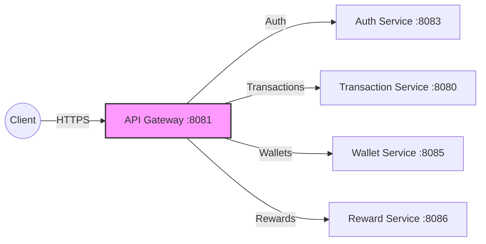

# Central Payment Ecosystem - API Gateway

Welcome to the **API Gateway** for the Central Payment Ecosystem! This service acts as the front door for all client requests, ensuring secure, fast, and reliable routing to the downstream microservices.

> **Explore the Ecosystem:** This repository is part of a larger microservices architecture.
> - **API Gateway (You are here)** - The central entry point and JWT verifier.
> - [Authentication Service](https://github.com/sarvesh873/101_Central_Authentication-Service) - Manages users and registration.
> - [Wallet Service](https://github.com/sarvesh873/101_Central_Wallet-Service) - Manages balances and holds.
> - [Reward Service](https://github.com/sarvesh873/101_Central_Reward-Service) - Evaluates transactions to issue rewards.
> - [Transaction Service](https://github.com/sarvesh873/101_Central_Transaction-Service) - Core engine handling two-phase commits.

---

## 🧭 Role in the Architecture

The API Gateway is built on **Spring Cloud Gateway**. It performs the following critical roles:
1. **Dynamic Routing**: Maps incoming API calls to their respective internal services.
2. **Authentication & Authorization**: Intercepts requests, validates JWT tokens, and injects user identity headers (`X-User-Code`) before forwarding them downstream.
3. **CORS Management**: Handles cross-origin requests for the frontend clients.



## 🚀 Features

- **JWT Authentication Filter**: Custom gateway filter that strictly validates Bearer tokens.
- **Header Injection**: Securely extracts and propagates the `X-User-Code` to internal downstream services.
- **Resilience4j Circuit Breakers**: Prevents cascading failures by opening circuits when downstream services are slow or down, complete with a global `/fallback` response.
- **Redis-Backed Rate Limiting**: Token-bucket rate limiting based on `X-User-Id` or IP address, with strict capacities on transaction endpoints to prevent abuse.
- **Exponential Backoff Retries**: Automatically retries failed `GET` and `POST` requests with 10s-20s backoffs to absorb traffic spikes without overwhelming downstream services.
- **Java 21 Virtual Threads**: Highly optimized I/O operations without blocking standard platform threads.

## 📋 Prerequisites

- Java 21 or higher
- Maven 3.8+
- Docker & Docker Compose
- **Redis** (Required for Rate Limiting)

## 🛠️ Tech Stack

- **Framework**: Spring Boot 3.4.x, Spring Cloud Gateway 2024.0.0
- **Resilience**: Spring Cloud CircuitBreaker (Resilience4j)
- **Caching/State**: Spring Data Redis Reactive
- **Security**: Spring Security (WebFlux), JJWT (0.13.0)
- **Monitoring**: Prometheus, Micrometer, Actuator
- **Java**: Java 21 (Virtual Threads Enabled)

## 🛣️ Routing Rules

- `/api/auth/**` ➡️ Authentication Service (`8083`)
- `/api/transactions/**` ➡️ Transaction Service (`8080`)
- `/api/wallets/**` ➡️ Wallet Service (`8085`)
- `/reward_service/api/**` ➡️ Reward Service (`8086`)

## 🚀 Getting Started

### Local Development

1. **Clone the repository**
   ```bash
   git clone https://github.com/sarvesh873/101_Central_API-Gateway.git
   cd 101_Central_API-Gateway
   ```

2. **Start Redis** (Required for rate limiting)
   ```bash
   docker run -d -p 6379:6379 redis
   ```

3. **Build and run**
   ```bash
   mvn clean install
   mvn spring-boot:run
   ```

## 🔧 Configuration

Key properties located in `application.yml`:

| Environment Variable / Key | Description | Default |
|----------------------|-------------|----------------|
| `server.port` | Application port | 8081 |
| `spring.threads.virtual.enabled` | Enable virtual threads | true |
| `spring.data.redis.host` | Redis host | localhost |
| `jwt.secret` | Base64 encoded signing key | U2VjdX... |
| `resilience4j.circuitbreaker.*` | Failure rates and sliding window settings | (See yaml) |


## 📚 API Documentation

Once the application is running, access the following:

- **Swagger UI**: http://localhost:8081/swagger-ui.html
- **OpenAPI 3.0 Docs**: http://localhost:8081/v3/api-docs

## 🧪 Testing

Run the test suite with coverage:

```bash
mvn clean test jacoco:report
```

## 🚀 Deployment upcoming

### Kubernetes

```bash
kubectl apply -f k8s/
```

### Helm

```bash
helm install api-gateway ./charts/api-gateway
```

## 🛡️ Security

- JWT Interception and Validation
- Identity Header Injection (X-User-Code)
- CORS configuration for downstream services
- Redis-backed Rate limiting

## 📈 Monitoring

The service exposes Prometheus metrics at `/actuator/prometheus` and includes:

- Request/response metrics
- JVM metrics
- Circuit Breaker metrics (Resilience4j)
- Custom routing metrics

## 🤝 Contributing

1. Fork the repository
2. Create your feature branch (`git checkout -b feature/AmazingFeature`)
3. Commit your changes (`git commit -m 'Add some AmazingFeature'`)
4. Push to the branch (`git push origin feature/AmazingFeature`)
5. Open a Pull Request
